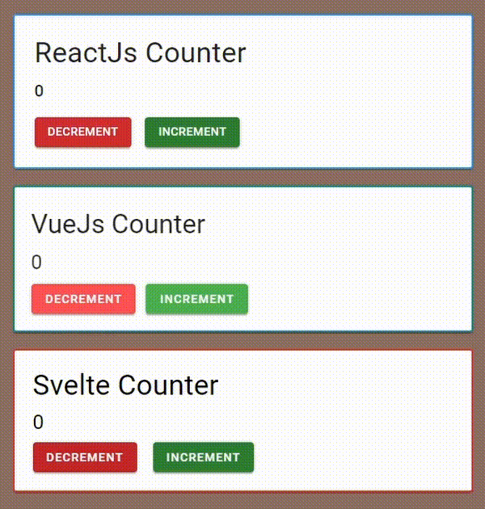
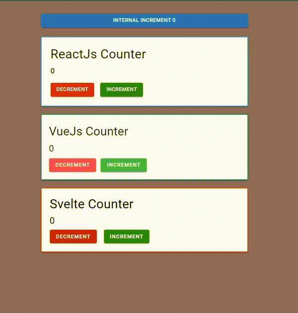

#  Sudy on Micro Front-ends

This repository contains my sudies on Micro Front-ends using [Module Federation](https://webpack.js.org/concepts/module-federation/)

<p align="center">
    
</p>

## Introduction

Every since I learnt about **Module Federation**, I got interested about the technology and how it could help big companies with big teams separating each squad with their own repository/project. I had a lot of ideas and wanted to test them out and see what was possible. The tests I wanted to do are:

- [x] Is it possible to add multiple web frameworks inside one application?
- [x] Is it possible to add one central state manager that persists within those frameworks?
- [-] Is it possible for a host to share modules to itself?
- [-] Is developer experience good using **Module Federation**?

## Multiple frameworks

Thinking about big teams, making an architecture where changing technologies is not a pain is valuable. If you want to use a new hyped javascript framework but your codebase is still in JQuery you could use Micro Front-Ends to do so.

To test if **Module Federation** can integrate multiple frameworks, I created a `host` app in React and configured it using `webpack`. Then, I used `react-router-dom` to create a basic routing system. After that, I implemented simple projects in **Vue**, **Svelte**, and **React** that exported a **Counter** component.

Keep in mind that I also wanted to test the React to React integration, that's why there is another React project. Also, I used the Material Design libraries to make the widgets prettier.

### React Counter

```tsx
import React, { useState } from 'react';
import { Button, Typography, Card, colors } from '@mui/material';

export const Counter = () => {
  const [counter, setCounter] = useState(0);

  return (
    <Card>
      <Typography variant="h4">ReactJs Counter</Typography>
      <Typography variant="h6" sx={{ marginTop: 1 }}>
        {counter}
      </Typography>
      <Button onClick={() => setCounter((p) => p--)}>Decrement</Button>
      <Button onClick={() => setCounter((p) => p++)}>Increment</Button>
    </Card>
  );
};
```

### Vue Counter

```vue
<template>
  <!-- The v- components are from vuetify -->
  <v-app>
    <v-card>
      <h1>VueJs Counter</h1>
      <h2>{{ counter }}</h2>
      <div>
        <v-btn v-on:click="decrement">Decrement</v-btn>
        <v-btn v-on:click="increment">Increment</v-btn>
      </div>
    </v-card>
  </v-app>
</template>

<script lang="js">
export default {
  name: 'Counter',
  data() {
    return {
      counter: 0,
    };
  },
  methods: {
    increment() {
      this.counter++;
    },
    decrement() {
      this.counter--;
    },
  },
};
</script>
```

### Svelte Counter

```svelte
<script lang="ts">
  import Button, { Label } from '@smui/button';
  import Card, { Content } from '@smui/card';

  let count = 0;
  function increment() {
    count++;
  }
  function decrement() {
    count--;
  }
</script>

<Card>
  <Content>
    <h1>Svelte Counter</h1>
    <h2>{count}</h2>
    <Button on:click={decrement}><Label>Decrement</Label></Button>
    <Button on:click={increment}><Label>Increment</Label></Button>
  </Content>
</Card>
```

### The integration

The UI is now created, but how can I connect them using **Module Federation**?

Turns out that importing a React component is really easy.

```tsx
import { Box, Button } from '@mui/material';
import { Counter } from 'react/Counter';

export const CounterGame = () => {
  return (
    <Box sx={{...}}
    >
      <Counter />
    </Box>
  );
};

```

The other frameworks were not that easy to connect. Since they are so different, it's obvious that there is no straight forward integration. The way I implemented **Svelte** and **Vue** was by creating a new instance of each component inside a `div` in **React**. It's the same as creating a new app `new App({ target: document.getElementById('root') });` but instead of rendering in the `root`, we will pick an element inside the **React** DOM.

```ts
import Counter from '@app/components/Counter.svelte';
import '@app/styles/smui.css';

export function render(element: HTMLElement) {
  new Counter({ target: element });
}
```

and

```ts
import Vue from 'vue';
import Counter from '@app/components/Counter.vue';

export function render(element: string) {
  new Vue({ render: (h) => h(Counter) }).$mount(element);
}
```

The end result at the `host` app is something like:

```tsx
import { Counter } from 'react/Counter';
import { render as vueRender } from 'vue/render';
import { render as svelteRender } from 'svelte/render';

export const CounterGame = () => {
  const vueRef = React.useRef<HTMLDivElement | null>(null);
  const svelteRef = React.useRef<HTMLDivElement | null>(null);
  const once = React.useRef(false);
  React.useEffect(() => {
    if (!once.current) {
      vueRender(vueRef.current!);
      svelteRender(svelteRef.current!);
      once.current = true;
    }
  }, []);
  return (
    <Box
      sx={{...}}
    >
      <Counter />
      <div ref={vueRef}></div>
      <div ref={svelteRef}></div>
    </Box>
  );
};
```

## Global state manager

But what if we want to share the `count` state so that all the Counter Widgets change at the same time? For that, we have to use some global state manager solution.

Because `React Context`, `Vuex`, or `Svelte writable` are framework sepcific, we have to find a generic **State Manager** that works on every framework. The easiest one to use I could find is `Mobx State-Tree`.

```ts
import { types } from 'mobx-state-tree';

export const Counter = types
  .model({
    count: types.number,
  })
  .actions((self) => ({
    increment() {
      self.count++;
    },
    decrement() {
      self.count--;
    },
  }));

export const Root = types.model({
  counter: Counter,
});

let _store: RootStore;
export function useStore() {
  if (!_store) {
    _store = Root.create(RootDefaultValues);
  }
  return _store;
}
```

Now, I can expose the `useStore` hook via **Module Federation** for the other projects to use.

```js
new ModuleFederationPlugin({
  name: 'host',
  filename: 'remoteEntry.js',
  remotes: {
    host: 'host@http://localhost:3000/remoteEntry.js',
    react: 'react@http://localhost:3001/remoteEntry.js',
    vue: 'vue@http://localhost:3002/remoteEntry.js',
    svelte: 'svelte@http://localhost:3003/remoteEntry.js',
  },
  exposes: {
    './Store': './src/providers/Store',
  },
  shared: {
    ...
  },
});
```

Then, we just have to implement the respective frameworks `Mobx` bindings and use the `useStore` function without fear.

### React Mobx Counter

```tsx
import { observer } from 'mobx-react-lite';
import { useStore } from 'host/Store';

export const Counter = observer(() => {
  const { counter } = useStore();

  return (
    <Card>
      <Typography variant="h4">ReactJs Counter</Typography>
      <Typography variant="h6" sx={{ marginTop: 1 }}>
        {counter}
      </Typography>
      <Button onClick={() => counter.increment()}>Decrement</Button>
      <Button onClick={() => counter.decrement()}>Increment</Button>
    </Card>
  );
});
```

### Vue Mobx Counter

```vue
<template>
  <v-card>
    <h1>VueJs Counter</h1>
    <h2>{{ counter }}</h2>
    <div>
      <v-btn v-on:click="counter.decrement">Decrement</v-btn>
      <v-btn v-on:click="counter.increment">Increment</v-btn>
    </div>
  </v-card>
</template>

<script lang="js">
import { observer } from 'mobx-vue';
import { useStore } from 'host/Store';

export default observer({
  name: 'Counter',
  data() {
    const { counter } = useStore();
    return {
      counter: counter,
    };
  },
});
</script>
```

### Svelte Mobx Counter

```svelte
<script context="module">
  import { connect } from 'svelte-mobx';
</script>

<script lang="ts">
  import { useStore } from 'host/Store';

  const { autorun } = connect();
  let { counter } = useStore();

  let count: number;
  function increment() { counter.increment() };
  function decrement() { counter.decrement() };

  autorun(() => {
    count = counter.count;
  });
</script>

<Card>
  <Content>
    <h1>Svelte Counter</h1>
    <h2>{count}</h2>
    <Button on:click={decrement}><Label>Decrement</Label></Button>
    <Button on:click={increment}><Label>Increment</Label></Button>
  </Content>
</Card>
```

## Host sharing code with itself

The counter state is being shared just fine, but for a lot of use cases, the **Host** will also use the Global Store.

Think of an authentication system. The **Host** app will handle `routing`, `private/public routes`, `login`, etc. And it will maybe share a store containing variables like `user`, `isAuthenticated`, `login()`, `logout()`, etc. With that, it's clear that the **Host** will also need to use the Global State Manager.

For some reason though, when I started using the `useStore` function, I got the following bug.

<p align="center">
    
</p>

Sometimes, when I reload the page, the Stores get desynced. The only way I found to fix this bug is by doing something like:

```js
new ModuleFederationPlugin({
  ...,
  exposes: {
    './Store': './src/providers/Store',
  },
  shared: {
    './src/providers/Store': {
      singleton: true,
    },
    ...
  },
});
```

But I honestly don't know if there is a better solution...

## Developer Experience

The developer experience is different. Since **Module Federation** works with runtime injection of Javascript, tools like **Hot Module Replacement (HMR)** are not that great, especially when working with different frameworks. The good news is that the host app can have hot reload, just the remote components that cannot have.

## Conclusion

To wrap up the study. My conclusions are that **Module Federation** is a powerful tool especially if you have a big codebase and want to break it down into smaller repos or if you want to build multiple teams working on the same website. Another good thing is that integration with other frameworks is quite easy so you will be able to use the most hyped javascript framework.

The downsides are the difficulties of sharing stateful modules and not being able to use `HMR`.
